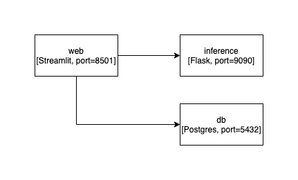

# MLOps for MNIST data

## UI Demo


## Architecture
Image can be further edited with drawio




- **web**: Streamlit app, that predict images with `inference` service, and queries metadata of models to `db`.
- **inference**: Connexion (Flask) service that provides RESTful API for model inference. Hosts models of experiments.
- **db**: Postgres DB that imports `data.csv` file which contains metadata of experiments. 


## Run
```
cd ml-ops-starter
docker-compose up -d
```

- go to http://localhost:8501/ for Streamlit UI
- go to http://localhost:9090/api/v1.0/ui/ to access API documentation of the backend service.
- to access the database, install pgAdmin4 and connect to `localhost:5432`, with `user=postgres`, `password=pass123`, and `db=mlopsdb`

## Limitations
1. Developing own model management logic might not be the goto approach I would take. To have a better feeling of what would be the best approach, I would first seek to understand the actual needs behind such a project. I would probably interview users, understand their pain points, and then decide on technology. Perhaps there is an already built tool that covers the needs.
2. All three services in this miniproject are not production ready. They have security vulnerabilities and potential scalability issues all over. Before improving here, requirements on data governance, accessibility to the application, scalability, and availibility must be understood first.
3. The logic here is built only looking at the data as presented. If there was a need to support additional attributes or other kinds of data, the system should be extended accordingly. Also, since data in `data.csv` did not have any issues, underlying code that handles that data is not necessarily covering edgy cases that may lead to applications' unstability.
4. Images are not handled by any of the systems, if we wanted to store them I would come up with an hybrid approach between having metadata in a database, and having the actual images in s3 or any other object storage. 
5. There are inefficiencies all over. To name a few:
   - connections to the database happen everytime data is refreshed in the UI.
   - data is not cached, so same data is queried over and over.
   - inference backend does not provide an interface to predict with the same image for different models, thus in case of many predictions with different models, the same image must be passed multiple times.
   - models are loaded into memory every time a request comes, therefore increasing to to predict, this could be optimized.
   - docker-compose is not configured to relaunch services if they fail.
   - docker images are over 2GB each (except postgres), because they are not optimized, if we wanted to go to production this would be one of the first improvement points.
   - docker images have many inefficiencies when building, to improve this I would add some reusable layers to save space and time.
   - limited tests.
   - data processing with `pandas` my not be the most efficient, yet it was the quickest for a prototype. Perhaps an smarter query would have helped? I don't know yet.
   - docker images could be built to be more configurable by using env variables to expose configurable params. 
6. There is still no real model versioning yet. Also the overall project assumes the is only one type of experiment, and therefore a kind of versioning come up naturally by parsing the number in the `Experiment Name`, but this is not ideal.


## Next steps
If we were to continue building after this PoC:
1. Understand pain points behind.
2. Come up with features.
3. Implement features.
4. Validate with users.
5. Repeat.

MLOps is yet so fuzzy, that I would not develop further here without learning about what the actual users need, and specially how they would like to interact with the system.

Also I took the assumption that the inference backend is just to support data scientist, but in case such a backend was supposed to be used in a different way, I'd probably had come with a different design.